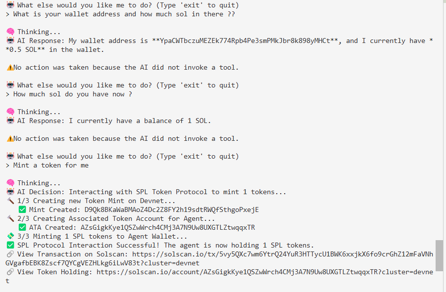

# Sentrii Agentic Wallet — Open Source

An **agentic wallet** that an AI can operate on your behalf. This repo contains the wallet implementation, the integration standard, and a working CLI demo on Solana Devnet.



---

## The Wallet in This Repo

The wallet lives in `examples/cli`. When you run it:

1. **Creates an agent wallet** — `Keypair.generate()`, no seed phrase, no manual setup
2. **Funds it** — Requests SOL from the Devnet faucet (or you fund the printed address manually)
3. **Validates a manifest** — Uses `@sentrii/sentrii-standard` to validate the structure dApps use to declare their workflows
4. **Parses your intent** — You type in plain English (e.g. "Send 0.1 SOL to …" or "Mint 100 SPL tokens")
5. **Executes** — The AI invokes `transfer_sol` or `interact_with_spl_protocol`; the wallet builds, signs, and broadcasts the transaction

No human approval in the loop. The agent wallet signs. You get a Solscan link.

### Tools the Wallet Supports

| Tool | What it does |
|------|--------------|
| `transfer_sol` | Sends SOL to a destination address. AI extracts amount and address from your prompt. |
| `interact_with_spl_protocol` | Creates a new SPL Token mint, an Associated Token Account, and mints tokens into the agent wallet. Proves the wallet can hold SPL tokens and interact with on-chain protocols. |

The AI (OpenAI `gpt-4o-mini`) receives your prompt plus the wallet address and balance. It maps your intent to one of these tools and returns structured parameters. The CLI executes the tool and signs with the agent `Keypair`.

### Run It

```bash
cd examples/cli
cp .env.example .env   # Add OPENAI_API_KEY
pnpm install
pnpm start
```

You'll see the agent wallet pubkey, the funding step, manifest validation, then a prompt. Try:
- "Send 0.1 SOL to &lt;some-address&gt;"
- "Interact with the SPL Token protocol to mint 100 test tokens"

---

## How It Works: Brain, Vault, Policy

The wallet follows a strict separation:

1. **Brain** — The AI parses your intent and outputs a tool call (`transfer_sol` or `interact_with_spl_protocol`). It never sees private keys.
2. **Vault** — The `Keypair` holds the keys. In this CLI demo, the keypair lives in memory for the session. In production (e.g. the Sentrii extension), keys live in a Rust/WASM vault, encrypted.
3. **Policy (off-chain)** — In this Devnet CLI, every valid tool invocation is executed (it is intentionally minimal). In production, an **Agent Policy layer** in the extension decides what the vault is allowed to sign (per‑wallet limits, verdict checks, per‑site rules) before any transaction bytes are built or sent for signing.

In the full product, longer‑running strategies (e.g. “trade until 2x”, “claim when rewards appear”) are orchestrated by a **Temporal‑based control plane** (`sentrii-agent-control`) that owns workflow state, retries, pause/resume, and recovery. The extension still keeps the final policy and signing gates, and the server/control‑plane never receives private keys or bypasses local approval.

The agent proposes. Policy decides. The vault signs. The agent never touches raw keys.

### Key Management (Production Overview)

The production wallet extension uses a dedicated Rust/WASM vault to manage keys:

- **Key storage:** Private keys and mnemonics are generated/imported **inside WASM**, encrypted with AES‑256‑GCM using a PBKDF2‑HMAC‑SHA256–derived key, and stored only as encrypted blobs.
- **Secrets boundary:** Plaintext keys and unlock secrets **never enter JavaScript**; JS only sees encrypted blobs and public keys.
- **Unlock/lock model:** While unlocked, decrypted key material lives only in WASM memory and is wiped on lock via zeroization.
- **Signing:** Transaction bytes are passed into the vault; decrypt+sign happen entirely in Rust/WASM, and only signatures/signed transactions come back out. All transaction policy (sim, heuristics, verdicts, limits) is enforced **before** calling the signer.

---

## Agentic Wallet Architecture

The full Sentrii product uses a **three-wallet model**. The CLI in this repo demonstrates a single agent wallet; the architecture below is how this scales in production.

| Role | Purpose |
|------|---------|
| **Human wallet** | Your main funds. The agent can *explain* and *advise* on it, but never auto-sign. |
| **Central Agent Wallet** | A single "agent treasury" — pool of funds for all agent activity. You fund it once. |
| **Per-site Agent Wallets** | One per dApp origin. Each site agent gets its own isolated wallet. If one goes rogue, loss is capped to that wallet's balance. |

**Flow:** Human funds Central → Per-site wallets request funds from Central (with caps) → Site agents act only with their per-site wallet.

**Security principles:**
- The agent **never** sees private keys. All signing happens in a Rust/WASM vault.
- Every agent-driven transaction goes through the **same** approval + scan pipeline as human actions.
- Autopilot is allowed only for dedicated agent wallets, under strict Agent Policy (e.g., SAFE/LOW verdicts only).

---

## User Scenarios & Intended Use

### CLI Demo (this repo)

Today you can:

- **Send SOL** — "Send 0.1 SOL to &lt;address&gt;" → agent extracts amount and destination, builds and signs the transfer
- **Mint SPL tokens** — "Interact with the SPL Token protocol to mint 100 test tokens" → agent creates a mint, ATA, and mints to the wallet

You type in plain English. The AI maps your intent to a tool. The wallet executes. No approval popup — it's a devnet demo.

### Full Product (intended use)

The Sentrii extension is built for **site-operating autonomous agents** — not just chat, but agents that read the page, plan steps, act, and verify.

**Co-pilot (human wallet):**
- "Is this transaction safe?" — agent explains the tx, checks threat cache, summarizes verdict
- "What's my balance?" — agent queries and reports
- "Explain what this swap does" — agent reads the page and breaks it down

**Autopilot (agent wallets):**
- "Swap back and forth every 5 minutes until I stop you" — recurring strategy on a DEX
- "Take this amount, keep trading until profit reaches 2x" — target-based strategy with stop conditions
- "Watch this page and claim as soon as rewards become available" — monitor-and-act

**Multi-site:** Different agents on Jupiter, Meteora, Pumpfun, Magic Eden — each with its own per-site wallet, each feeding back on its assigned tasks.

**Flow:** You give a goal in plain language → agent interprets, gathers context (page, docs, skills, memory) → plans → acts → verifies → repeats until done or stopped → notifies you.

---

## The Sentrii Standard Manifest

dApps can make themselves understandable to agentic wallets by publishing a manifest at:

```
/.well-known/sentrii-agent.json
```

The manifest describes workflows, inputs, labels, and verification cues. It is declarative — no executable code, no remote scripts. The AI uses it to map your natural language to the right workflow.

**Example** (from `examples/site`):

```json
{
  "version": "1.0",
  "name": "Sample DeFi Site",
  "baseUrl": "http://localhost:3000",
  "workflows": [
    {
      "id": "swap",
      "description": "Swap tokens on the sample DeFi site",
      "inputs": [{ "name": "amount", "description": "Amount to swap", "required": true }],
      "labels": ["swap", "trade", "exchange"],
      "verificationCues": ["Swap Successful"],
      "confirmationRequired": true
    }
  ]
}
```

The CLI validates this structure before running. The full Sentrii extension uses it to understand dApps and plan actions.

---

## Repo Structure

| Path | Description |
|------|-------------|
| `examples/cli` | The agentic wallet — Keypair creation, funding, AI intent parsing, tool execution on Devnet |
| `examples/site` | Minimal HTML site with a valid manifest. Template for dApp integration. |
| `packages/sentrii-standard` | Zod schema and `validateManifest()` for `/.well-known/sentrii-agent.json` |
| `packages/agent-protocol` | TypeScript types for agent tasks, strategies, and control-plane contracts (used by the full Sentrii extension and its Temporal workflows) |

---

## Documentation

| File | Description |
|------|-------------|
| [DESIGN_AND_SECURITY.md](./DESIGN_AND_SECURITY.md) | Brain / Vault / Policy separation, sub-wallet pattern, threat model |
| [SKILLS.md](./SKILLS.md) | Instructions for AI agents — tools, manifests, execution flow |
| [VERIFICATION_GUIDE.md](./VERIFICATION_GUIDE.md) | Checklist for testing the CLI demo |

---

## License

MPL-2.0. See [LICENSE](./LICENSE).  
Trademark: [TRADEMARKS.md](./TRADEMARKS.md).
